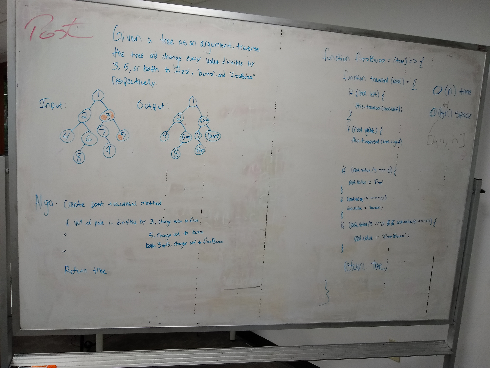

# data-structures-and-algorithms

## Reverse an Array
This is the first whiteboarding challenge where I was to create a function that reverses the contents of a given array without returning a new array or using built-in JavaScript methods. I ended up using an additional array which I did not know was forbidden at the time, but I did not return that array according to the instructions.

### Challenge
Write a function called reverseArray which takes an array as an argument. Without utilizing any of the built-in methods available to your language, return the provided array argument with elements in reversed order.

### Solution

### Shift an Array
This challenge was to take 2 inputs, one array and one value, and insert the given value into the middle index of the array. This was pretty easy to do since we were allowed to use built-in methods and splice could do exactly what I needed.

### Challenge
Insert and shift an array in middle at index

### Solution

## Linked List Insertions
This challenge included the creation of 3 methods for an already existing linked list constructor. The 3 methods included adding new nodes to a linked list. One that appended a new node to the tail, one that, given a value, inserts a new node before that value, and finally a method that inserted a new node after a given value.
### Challenge
    Write the following methods for the Linked List class:

- .append(value) which adds a new node with the given value to the end of the list

- .insertBefore(value, newVal) which add a new node with the given newValue immediately before the first value node

- .insertAfter(value, newVal) which add a new node with the given newValue immediately after the first value node
You have access to the Node class and all the properties on the Linked List class.

### Solution

## Linked List kth from end
This challenge included creating another method for the LinkedList class that takes in a value, k,
and returns the value of the node that is k nodes from the end of the list. 
### Challenge
    Write the following methods for the Linked List class:

Write a method for the Linked List class which takes a number, k, as a parameter. Return the node’s value that is k from the end of the linked list. You have access to the Node class and all the properties on the Linked List class as well as the methods created in previous challenges. ​

### Solution

## Linked List Merge
This challenge included creating another method for the LinkedList class that takes in two separate linked lists and merges them in alternating order.
### Challenge
    Write the following methods for the Linked List class:
Write a function called mergeLists which takes two linked lists as arguments. Zip the two linked lists together into one so that the nodes alternate between the two lists and return a reference to the head of the zipped list. Try and keep additional space down to O(1). You have access to the Node class and all the properties on the Linked List class as well as the methods created in previous challenges.
### Solution

## Creating a Queue with Two Stacks
This challenge included creating a method that takes two LIFO stacks and manipulates them using only push and pop methods to create a FIFI queue.
### Challenge
Create a new Queue class. Using two Stack instances, implement this Queue with the following methods:

- enqueue(value) which inserts value into the Queue using a first-in, first-out approach.
- dequeue() which extracts a value from the Queue using a first-in, first-out approach.
- The Stack instances have only push and pop methods, and a size property. Instantiate these Stack objects in your Queue constructor.
### Solution

## Creating a FIFO AnimalShelter Class
This challenge included creating a method that takes two LIFO stacks and manipulates them using only push and pop methods to create a FIFI queue.
### Challenge
Create a class called AnimalShelter which holds only dogs and cats. The shelter operates using a first-in, first-out approach.
Implement the following methods:
enqueue(animal): adds animal to the shelter. animal can be either a dog or a cat object.
dequeue(pref): returns either a dog or a cat. If pref, a string, is ‘cat’ return the longest-waiting cat. If pref is ‘dog’, return the longest-waiting dog. For anything else, return either a cat or a dog.
- enqueue(value) which inserts value into the Queue using a first-in, first-out approach.
- dequeue() which extracts a value from the Queue using a first-in, first-out approach.
- The Stack instances have only push and pop methods, and a size property. Instantiate these Stack objects in your Queue constructor.
### Solution

## Creating a binary tree fizzbuzz function
This challenge included creating a method that takes a tree and swaps any values divisible by 3 for the string 'fizz', any values divisible by 5 for the string 'buzz',
and any values divisible by 3 and 5 for the string 'fizzbuzz'.
### Challenge
- Write a function called FizzBuzzTree which takes a tree as an argument.
Without utilizing any of the built-in methods available to your language, determine weather or not the value of each node is divisible by 3, 5 or both, and change the value of each of the nodes respectively. Return the tree with it’s news values.
### Solution

## Repeated Word Challenge
This challenge included creating a function that takes a lengthy string in as an argument and returns the first word that is repeated in the string. We had to use hashmaps to maintain an O(n) of time.
### Challenge
Write a function that accepts a lengthy string parameter.
Return the first word to occur more than once in that provided string.
### Solution

## Binary Tree Intersection
This challenge included creating a function that takes two binary trees in as arguments and returns an array with common values hared between the two
### Challenge
Write a function called tree_intersection that takes two binary tree parameters.
return a set of values found in both trees.
### Solution

## Binary Tree Parent/Child Finder
This challenge included creating a function that takes two values and a binary tree and returning true if the first value is a parent of the second value in the tree.
### Challenge
Write a function that takes in 2 values and a binary tree as arguments
return true if the first value given is a parent of the second value
### Solution

## Multi Bracket Validation
This challenge included creating a function that takes two values and a binary tree and returning true if the first value is a parent of the second value in the tree.
### Challenge
Your function should take a string as its only argument, and should return a boolean representing whether or not the brackets in the string are balanced. There are 3 types of brackets:
### Solution
